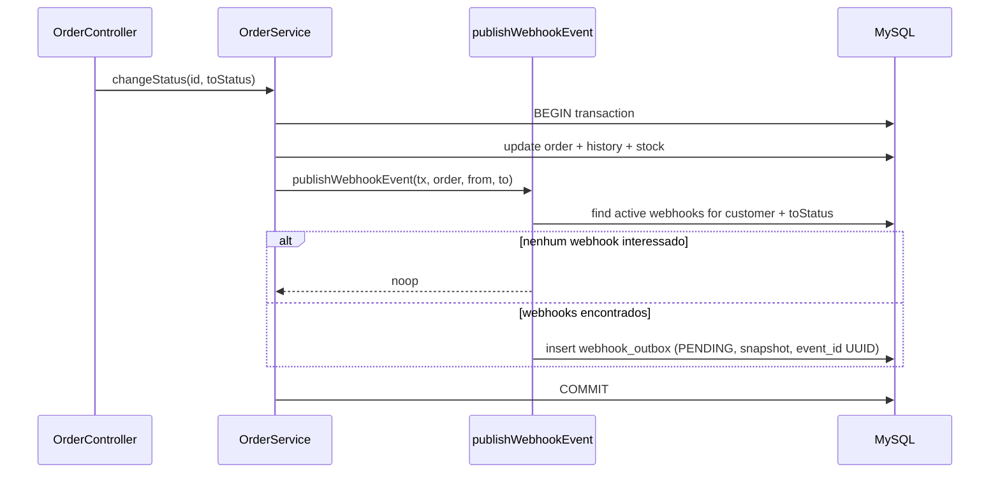

# FDD — Feature Design Document: Webhooks de Notificação de Pedidos

| Campo | Valor |
|-------|--------|
| **Feature** | Sistema de Webhooks de Notificação de Pedidos |
| **Status** | Draft para implementação |
| **Base** | [RFC](RFC.md), [ADRs](adrs/README.md), [PRD](PRD.md) |
| **Stack** | Node.js + TypeScript, Express, Prisma, MySQL (já existentes) |

---

## 1. Contexto e motivação técnica

O OMS não possui notificação externa. Clientes B2B fazem polling em `GET /api/v1/orders`. A feature preenche esse vácuo com webhooks outbound disparados na mudança de status, sem degradar a transação de `OrderService.changeStatus` e sem introduzir broker externo nesta fase.

Decisões arquiteturais fechadas: [ADR-001](adrs/ADR-001-outbox-no-mysql.md) a [ADR-006](adrs/ADR-006-reuso-padroes-do-projeto.md). Este FDD descreve **como construir**.

---

## 2. Objetivos técnicos

1. Inserir evento na outbox **na mesma** `$transaction` de `changeStatus`.
2. Entregar HTTP assíncrono com latência típica **&lt; 10s** (polling 2s + processamento).
3. Garantir autenticação HMAC-SHA256, HTTPS obrigatório, secret por endpoint e rotação com grace 24h.
4. Implementar retry/backoff/DLQ e replay admin com auditoria.
5. Expor CRUD de configuração + histórico de deliveries reutilizando padrões do projeto.

---

## 3. Escopo e exclusões

**Incluso:** modelos Prisma de webhook/outbox/delivery/DLQ; módulo `src/modules/webhooks`; `src/worker.ts`; integração em `changeStatus`; endpoints HTTP abaixo; observabilidade básica.

**Exclusões (confirmadas na reunião):**

- Disparo HTTP síncrono no service de orders
- Redis Streams / broker externo
- Exactly-once end-to-end
- E-mail de alerta por falhas
- Dashboard/painel visual
- Rate limiting de saída (observar primeiro)
- Arquivamento automático de linhas entregues (~30 dias)
- Multi-worker / particionamento por `order_id`

---

## 4. Modelagem de dados (proposta)

Novos models em `prisma/schema.prisma` (não implementados neste entregável documental):

| Model / tabela | Papel |
|----------------|--------|
| `WebhookEndpoint` / `webhook_endpoints` | url, secret(s), customerId, eventStatuses (JSON/lista), active, timestamps; IDs UUID |
| `WebhookOutbox` / `webhook_outbox` | eventId, webhookId, orderId, status (`PENDING` \| `PROCESSING` \| `FAILED` \| `DELIVERED`), payload JSON snapshot, attemptCount, nextAttemptAt, lastError, createdAt |
| `WebhookDelivery` / `webhook_deliveries` | histórico por tentativa/envio (status HTTP, response body truncado, durationMs, createdAt) |
| `WebhookDeadLetter` / `webhook_dead_letter` | payload, reason, outbox/event refs, createdAt |

Índices mínimos na outbox: `(status, nextAttemptAt, createdAt)` para o poller.

Secret atual + secret anterior com `previousSecretExpiresAt` (grace 24h) no endpoint.

---

## 5. Fluxos detalhados

### 5.1 Criação do evento na outbox



Regras:

- Se a inserção na outbox falhar → rollback da mudança de status.
- Payload **snapshot** na inserção (não re-renderizar no envio).
- Filtro de eventos **na inserção**: se nenhum webhook do customer inclui `to_status`, não cria linha.
- Limite de payload **64KB**; se o snapshot serializado exceder → falhar a operação com `WEBHOOK_PAYLOAD_TOO_LARGE` (e rollback da tx) — tamanho anormal indica bug.
- `event_type`: `order.status_changed`.

### 5.2 Processamento pelo worker

1. Loop a cada **2s**.
2. Selecionar batch pequeno de linhas `PENDING` (ou `FAILED` com `nextAttemptAt <= now`) ordenadas por `created_at`.
3. Marcar `PROCESSING` (evitar double-pick no single-worker; preparado para evolução).
4. Montar HTTP POST para a URL do endpoint:
   - Body = payload snapshot
   - Headers: ver seção 6.6
   - Timeout: **10s**
5. Sucesso (2xx): marcar `DELIVERED`; gravar `WebhookDelivery`.
6. Falha (timeout, 5xx, rede, 4xx não-recuperável conforme política): incrementar `attemptCount`, calcular `nextAttemptAt` pelo backoff, status `FAILED` (ainda elegível a retry) ou mover para DLQ se `attemptCount >= 5`.

### 5.3 Retry (backoff)

| Tentativa após falha | Delay até próxima |
|----------------------|-------------------|
| 1ª | 1 minuto |
| 2ª | 5 minutos |
| 3ª | 30 minutos |
| 4ª | 2 horas |
| 5ª | 12 horas |

Após a 5ª falha → mover para `webhook_dead_letter` e remover/encerrar na outbox operacional.

### 5.4 DLQ e replay

- `POST /api/v1/admin/webhooks/dead-letter/:id/replay` com `requireRole('ADMIN')`.
- Recria/reinsere na outbox como `PENDING` (novo ciclo de tentativas), **mesmo `event_id`** (cliente continua deduplicando).
- Logar `userId` do admin que disparou o replay (auditoria via Pino).

---

## 6. Contratos públicos

Prefixo da API existente: `/api/v1`. Todos os endpoints (exceto a entrega outbound ao cliente) exigem `Authorization: Bearer <JWT>`.

### 6.1 Criar webhook

`POST /api/v1/customers/:customerId/webhooks`

**Request**

```json
{
  "url": "https://atlas.example.com/hooks/orders",
  "eventStatuses": ["SHIPPED", "DELIVERED"],
  "active": true
}
```

**Response `201 Created`**

```json
{
  "id": "550e8400-e29b-41d4-a716-446655440000",
  "customerId": "7c9e6679-7425-40de-944b-e07fc1f90ae7",
  "url": "https://atlas.example.com/hooks/orders",
  "secret": "whsec_8f3a2c1b9e0d4a7b6c5d4e3f2a1b0c9d",
  "eventStatuses": ["SHIPPED", "DELIVERED"],
  "active": true,
  "createdAt": "2025-11-10T12:00:00.000Z"
}
```

> `secret` é gerada pelo sistema e **só retornada na criação** (e na rotação). Não reaparecer em GET/PATCH.

**Erros:** `400` `WEBHOOK_INVALID_URL` (http/não-https), `404` customer, `401` sem JWT.

---

### 6.2 Listar webhooks do customer

`GET /api/v1/customers/:customerId/webhooks`

**Response `200 OK`**

```json
{
  "data": [
    {
      "id": "550e8400-e29b-41d4-a716-446655440000",
      "customerId": "7c9e6679-7425-40de-944b-e07fc1f90ae7",
      "url": "https://atlas.example.com/hooks/orders",
      "eventStatuses": ["SHIPPED", "DELIVERED"],
      "active": true,
      "createdAt": "2025-11-10T12:00:00.000Z",
      "updatedAt": "2025-11-10T12:00:00.000Z"
    }
  ],
  "meta": { "page": 1, "pageSize": 20, "total": 1 }
}
```

*(Seguir helper `paginated` de `src/shared/http/response.ts`.)*

---

### 6.3 Atualizar webhook

`PATCH /api/v1/webhooks/:id`

**Request**

```json
{
  "url": "https://atlas.example.com/hooks/orders/v2",
  "eventStatuses": ["PAID", "SHIPPED", "DELIVERED"],
  "active": true
}
```

**Response `200 OK`** — mesmo shape do item da listagem (sem secret).

**Erros:** `404` `WEBHOOK_NOT_FOUND`, `400` `WEBHOOK_INVALID_URL`.

---

### 6.4 Remover webhook

`DELETE /api/v1/webhooks/:id`

**Response `204 No Content`**

**Erros:** `404` `WEBHOOK_NOT_FOUND`.

---

### 6.5 Histórico de entregas

`GET /api/v1/webhooks/:id/deliveries`

Retorna os últimos ~100 envios (ou paginado com default alinhado a ~100).

**Response `200 OK`**

```json
{
  "data": [
    {
      "id": "a1b2c3d4-e29b-41d4-a716-446655440111",
      "eventId": "c0ffee00-e29b-41d4-a716-446655440222",
      "success": false,
      "httpStatus": 503,
      "responseBody": "{\"error\":\"upstream down\"}",
      "durationMs": 842,
      "attempt": 2,
      "createdAt": "2025-11-10T12:05:02.000Z"
    }
  ],
  "meta": { "page": 1, "pageSize": 100, "total": 1 }
}
```

---

### 6.6 Rotacionar secret

`POST /api/v1/webhooks/:id/rotate-secret`

**Request:** body vazio `{}`

**Response `200 OK`**

```json
{
  "id": "550e8400-e29b-41d4-a716-446655440000",
  "secret": "whsec_NEVA_9a8b7c6d5e4f3a2b1c0d",
  "previousSecretExpiresAt": "2025-11-11T12:00:00.000Z"
}
```

Durante 24h o worker assina preferencialmente com a secret nova; a verificação no cliente pode aceitar ambas. Após o grace, só a nova é válida do nosso lado para assinatura.

---

### 6.7 Replay de DLQ (ADMIN)

`POST /api/v1/admin/webhooks/dead-letter/:id/replay`

**Response `200 OK`**

```json
{
  "deadLetterId": "dead-1111-e29b-41d4-a716-446655440333",
  "outboxId": "outb-2222-e29b-41d4-a716-446655440444",
  "eventId": "c0ffee00-e29b-41d4-a716-446655440222",
  "status": "PENDING"
}
```

**Erros:** `403` se não ADMIN, `404` `WEBHOOK_DEAD_LETTER_NOT_FOUND`.

---

### 6.8 Entrega outbound (worker → cliente)

Não é endpoint nosso; contrato do POST que o worker envia:

**Headers**

| Header | Valor |
|--------|--------|
| `Content-Type` | `application/json` |
| `X-Event-Id` | UUID do evento |
| `X-Signature` | HMAC-SHA256 do body (hex ou formato documentado no portal) |
| `X-Timestamp` | ISO 8601 do momento do envio |
| `X-Webhook-Id` | id do endpoint cadastrado |

**Body (exemplo)**

```json
{
  "event_id": "c0ffee00-e29b-41d4-a716-446655440222",
  "event_type": "order.status_changed",
  "timestamp": "2025-11-10T12:04:58.000Z",
  "order_id": "ord-uuid-...",
  "order_number": "ORD-000042",
  "from_status": "PROCESSING",
  "to_status": "SHIPPED",
  "customer_id": "7c9e6679-7425-40de-944b-e07fc1f90ae7",
  "total_cents": 15990
}
```

Sem `items`. Cliente busca detalhes em `GET /api/v1/orders/:id` se necessário.

---

## 7. Matriz de erros previstos

| Código | HTTP | Quando |
|--------|------|--------|
| `WEBHOOK_NOT_FOUND` | 404 | Webhook id inexistente |
| `WEBHOOK_INVALID_URL` | 400 | URL ausente, inválida ou não-HTTPS |
| `WEBHOOK_SECRET_REQUIRED` | 400 | Operação que exige secret e ela não está disponível/configurada |
| `WEBHOOK_PAYLOAD_TOO_LARGE` | 422 | Snapshot &gt; 64KB |
| `WEBHOOK_DEAD_LETTER_NOT_FOUND` | 404 | Replay de id inexistente na DLQ |
| `WEBHOOK_INACTIVE` | 409 | Tentativa de operar entrega/config inválida em endpoint inativo (quando aplicável) |
| `WEBHOOK_EVENT_FILTER_EMPTY` | 400 | `eventStatuses` vazio no create/patch |

Formato de resposta alinhado ao middleware atual:

```json
{
  "error": {
    "code": "WEBHOOK_NOT_FOUND",
    "message": "Webhook not found"
  }
}
```

Implementar como subclasses de `AppError` / helpers em `src/shared/errors/`, espelhando `InvalidStatusTransitionError`.

---

## 8. Estratégias de resiliência

| Mecanismo | Valor |
|-----------|--------|
| Timeout HTTP worker | 10s → falha + retry |
| Polling | 2s |
| Backoff | 1m / 5m / 30m / 2h / 12h (máx. 5 tentativas) |
| Fallback permanente | DLQ + replay admin |
| Payload | erro se &gt; 64KB (não truncar) |
| Duplicatas | at-least-once; cliente deduplica por `X-Event-Id` |
| Isolamento de processo | worker ≠ API; crash da API não derruba o poller (e vice-versa) |

Não há circuit breaker nem rate limit de saída nesta fase (questão em aberto no RFC).

---

## 9. Observabilidade

### Métricas (sugeridas)

- `webhook_delivery_success_total` / `webhook_delivery_failure_total`
- `webhook_delivery_duration_ms` (histograma)
- `webhook_outbox_pending_count` / `webhook_dead_letter_count`
- `webhook_retry_scheduled_total`

### Logs (Pino — `src/shared/logger`)

Campos estruturados: `eventId`, `webhookId`, `orderId`, `customerId`, `attempt`, `httpStatus`, `durationMs`, `adminUserId` (replay). Redact de `secret` / headers `Authorization` / assinaturas completas se necessário (padrão de redact já existe no logger).

### Tracing / correlação

- Propagar `X-Request-Id` nas rotas HTTP de configuração (middleware `request-logger`).
- Correlacionar entregas pelo `eventId` nos logs do worker.
- Opcional futuro: span OpenTelemetry `webhook.deliver` — não bloqueante para fase 1; na fase 1 basta correlação por ids nos logs.

---

## 10. Dependências e compatibilidade

- Mesmo `DATABASE_URL` / Prisma Client **por processo** (API e worker).
- JWT e roles `ADMIN` \| `OPERATOR` existentes.
- Enum `OrderStatus` existente como vocabulário de `eventStatuses`.
- Sem novas deps obrigatórias além do que o ecossistema Node já oferece para HMAC (`crypto`) e HTTP client (nativo ou lib já aceita no projeto).
- Compatibilidade: contrato de `PATCH /orders/:id/status` permanece; webhooks são side-effect interno via outbox.

---

## 11. Integração com o sistema existente

| Arquivo | Como integrar |
|---------|----------------|
| [`src/modules/orders/order.service.ts`](../src/modules/orders/order.service.ts) | Em `changeStatus`, dentro do `prisma.$transaction`, após `order.update` + `orderStatusHistory.create` (e ajustes de estoque), chamar `publishWebhookEvent(tx, order, from, to)`. Falha na outbox → rollback da tx. |
| [`src/modules/orders/order.status.ts`](../src/modules/orders/order.status.ts) | Reutilizar `OrderStatus` / `canTransition` como fonte de verdade dos status filtráveis em `eventStatuses` e no evento `order.status_changed`. |
| [`src/shared/errors/app-error.ts`](../src/shared/errors/app-error.ts) e [`src/shared/errors/http-errors.ts`](../src/shared/errors/http-errors.ts) | Novas classes/códigos `WEBHOOK_*` no mesmo padrão de `InvalidStatusTransitionError` / `InsufficientStockError`; export via `src/shared/errors/index.ts`. |
| [`src/middlewares/auth.middleware.ts`](../src/middlewares/auth.middleware.ts) | CRUD com `authenticate`; replay DLQ com `requireRole('ADMIN')` (mesmo padrão de `src/modules/users/user.routes.ts`). |
| [`src/middlewares/validate.middleware.ts`](../src/middlewares/validate.middleware.ts) | Schemas Zod em `webhook.schemas.ts` (URL https, lista de status, params). |
| [`src/routes/index.ts`](../src/routes/index.ts) e [`src/app.ts`](../src/app.ts) | Registrar `buildWebhookRouter` em `/webhooks` (e rotas nested de customers/admin); instanciar controllers/services no `buildControllers`. |
| [`src/server.ts`](../src/server.ts) | Referência de bootstrap; criar `src/worker.ts` análogo (Prisma + loop), **sem** compartilhar o mesmo processo Node. |
| [`src/shared/logger/index.ts`](../src/shared/logger/index.ts) | Logger do worker e auditoria de replay. |
| [`prisma/schema.prisma`](../prisma/schema.prisma) | Acrescentar models `WebhookEndpoint`, `WebhookOutbox`, `WebhookDelivery`, `WebhookDeadLetter` e relações com `Customer`/`Order`. |

Estrutura de módulo proposta:

```
src/modules/webhooks/
  webhook.controller.ts
  webhook.service.ts
  webhook.repository.ts
  webhook.routes.ts
  webhook.schemas.ts
  webhook.processor.ts   # ou webhook.worker.ts
  publish-webhook-event.ts
src/worker.ts
```

---

## 12. Critérios de aceite técnicos

1. Mudança de status com webhook ativo interessado cria exatamente as linhas de outbox esperadas **na mesma transação** (teste de rollback se insert falhar).
2. Worker entrega em &lt;10s no caminho feliz (poll 2s + HTTP).
3. URL `http://` rejeitada na validação; HTTPS aceito.
4. Assinatura HMAC verificável com a secret retornada na criação.
5. Após 5 falhas simuladas, evento aparece na DLQ; replay ADMIN recoloca como `PENDING`.
6. Operador não-ADMIN recebe 403 no replay.
7. `GET .../deliveries` lista tentativas com sucesso/falha.
8. Códigos de erro usam prefixo `WEBHOOK_` e passam pelo `errorMiddleware` existente.
9. Duplicata de entrega (retry após 200 perdido) mantém o mesmo `X-Event-Id`.

---

## 13. Riscos e mitigação

| Risco | Mitigação |
|-------|-----------|
| Acoplamento OrderService ↔ webhooks | Função pura `publishWebhookEvent(tx, ...)` com interface mínima |
| Crescimento da outbox | Índice + batch; arquivamento fora de escopo mas monitorado via métrica `pending_count` |
| Cliente lento | Timeout 10s + backoff; não bloqueia API |
| Secret vazada | Secret por endpoint + rotação 24h + revisão Sofia pré-deploy |
| Double processing futuro com multi-worker | Documentar single-worker; claim `PROCESSING` preparado |

---

## 14. Referências

- Transcrição: [`TRANSCRICAO.md`](../TRANSCRICAO.md)
- Produto: [PRD](PRD.md) · Arquitetura: [RFC](RFC.md) · Rastreio: [TRACKER](TRACKER.md)
