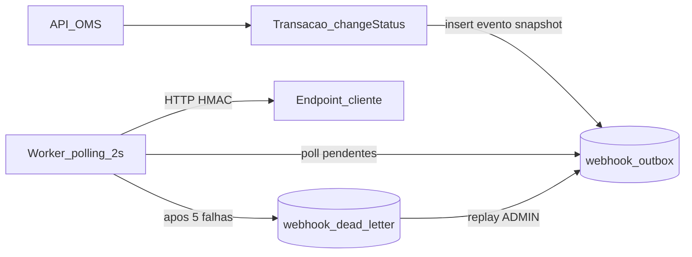

# RFC — Sistema de Webhooks de Notificação de Pedidos

| Campo | Valor |
|-------|--------|
| **Título** | Webhooks outbound para mudança de status de pedidos |
| **Autor** | Larissa (Tech Lead) |
| **Status** | Ready for Review |
| **Data** | Reunião técnica (quinta-feira, 09:00) |
| **Revisores** | Marcos (PM), Bruno (Eng. Pedidos), Diego (Eng. Plataforma), Sofia (Segurança) |
| **ADRs relacionados** | [ADR-001](adrs/ADR-001-outbox-no-mysql.md), [ADR-002](adrs/ADR-002-retry-backoff-e-dlq.md), [ADR-003](adrs/ADR-003-autenticacao-hmac-sha256.md), [ADR-004](adrs/ADR-004-entrega-at-least-once-x-event-id.md), [ADR-005](adrs/ADR-005-worker-polling-processo-separado.md), [ADR-006](adrs/ADR-006-reuso-padroes-do-projeto.md) |

---

## Resumo executivo (TL;DR)

Propor um sistema de **webhooks outbound** que notifica clientes B2B quando o status de um pedido muda, substituindo o polling atual em `GET /orders`.

A abordagem escolhida: **Transactional Outbox no MySQL** na mesma transação de `changeStatus`, **worker em processo separado** com polling a cada 2s, **retry com backoff** (5 tentativas) e **DLQ**, autenticação **HMAC-SHA256** com secret por endpoint, e entrega **at-least-once** com `X-Event-Id` para deduplicação no cliente. Reutilizamos os padrões do OMS (`src/modules/webhooks`, `AppError`, Zod, Pino, JWT/`requireRole`).

Detalhamento de contratos, fluxos e erros fica no [FDD](FDD.md). Decisões fechadas estão nos ADRs linkados acima.

---

## Contexto e problema

Três clientes B2B (Atlas Comercial, MaxDistribuição, Nova Cargo) pediram notificação em tempo real de mudança de status. Hoje eles fazem polling em `GET /orders`, o que é lento e caro na integração. Para eles, latência **abaixo de 10 segundos** já conta como tempo real. A Atlas indicou risco de migração para concorrente se a entrega não ocorrer até o fim do trimestre.

O OMS em produção **não possui** mecanismo de notificação externa, eventos, filas ou webhooks. A mudança de status já é transacional e sensível a latência (pedido + histórico + estoque). Qualquer solução precisa **não degradar** esse caminho crítico e **não acoplar** o sucesso da transição de status à disponibilidade do endpoint do cliente.

Escopo de direção: apenas **outbound** (plataforma → cliente).

---

## Proposta técnica

### Visão geral

1. **Configuração**: CRUD autenticado de webhooks por `customer_id` (URL HTTPS, lista de status desejados, secret gerada pelo sistema, rotação com grace 24h).
2. **Publicação**: em `OrderService.changeStatus`, após atualizar pedido/histórico/estoque, chamar `publishWebhookEvent(tx, ...)` na mesma `$transaction`, inserindo na outbox apenas se existir webhook ativo interessado naquele `to_status`. Payload já como **snapshot**.
3. **Entrega**: worker separado (`npm run worker`) faz polling a cada 2s, envia HTTP com timeout 10s, headers de assinatura/identidade, marca entregue ou agenda retry.
4. **Falha permanente**: após 5 tentativas (1m/5m/30m/2h/12h), move para `webhook_dead_letter`; replay manual por ADMIN.
5. **Semântica**: at-least-once; cliente deduplica por `X-Event-Id`.

### Princípios da proposta

| Princípio | Escolha |
|-----------|---------|
| Consistência evento ↔ status | Outbox na mesma transação SQL |
| Isolamento de falha do cliente | Assíncrono; nunca rollback de status por HTTP |
| Infra nesta fase | MySQL existente; sem broker novo |
| Segurança do canal | HMAC-SHA256 + HTTPS + secret por endpoint |
| Operação | Single-worker; DLQ + replay admin; histórico de deliveries via API |

### Fora desta RFC (detalhe no FDD)

Schemas de tabela campo a campo, payloads de exemplo de todos os endpoints, matriz completa `WEBHOOK_*`, e o passo a passo de integração com arquivos do repositório — ver [FDD](FDD.md).

---

## Alternativas consideradas

### 1. Chamada HTTP síncrona dentro de `changeStatus`

**Por que foi descartada:** a transação de status já atualiza `orders`, `order_status_history` e estoque. Um HTTP no meio trava mudança de status sob cliente lento e levanta a pergunta incorreta de “dar rollback no pedido se o webhook falhar”. Trade-off: simplicidade aparente vs. acoplamento e risco operacional inaceitável.

### 2. Redis Streams / Redis Cluster como transporte

**Por que foi descartada:** resolve desacoplamento e escala, mas exige subir e operar infra adicional. Para time pequeno, foi classificado como overengineering: o outbox no MySQL existente cobre o requisito de consistência e o SLA de &lt;10s com polling de 2s. Trade-off: capacidade de mensageria dedicada vs. custo operacional imediato.

*(Outras alternativas pontuais — trigger MySQL, exactly-once, secret global — estão registradas nos ADRs correspondentes.)*

---

## Questões em aberto

1. **Rate limiting de saída** — Se muitos pedidos mudarem de status em pouco tempo, o worker pode bombardear o endpoint do cliente. Decisão da reunião: observar em produção e implementar depois se virar problema. Sem desenho nesta fase.
2. **Endurecimento de autorização do CRUD** — Por enquanto qualquer role autenticada (ADMIN/OPERATOR) gerencia webhooks; endurecer (ex.: escopo por customer) fica para depois.
3. **Escala multi-worker** — Single-worker e ordering implícita por `order_id` nesta fase; particionamento ou lock pessimista é “problema do futuro”.
4. **Arquivamento da outbox (~30 dias)** e **alertas por e-mail** em falhas consecutivas — explicitamente fora / próxima fase, sem spec.

---

## Impacto e riscos

| Área | Impacto |
|------|---------|
| Pedidos | Extensão pontual de `changeStatus` para publicar na outbox na mesma transação |
| Infra | Novo processo (`worker`) + tabelas MySQL; sem Redis/Kafka |
| Segurança | Secrets por endpoint, HMAC, revisão Sofia ≥2 dias úteis pré-deploy |
| Clientes | Precisam expor HTTPS, verificar assinatura e deduplicar por `event_id` |
| Prazo | Estimativa: **3 sprints** incluindo revisão de segurança |

**Riscos principais**

- Atraso vs. expectativa Atlas (fim do trimestre) → mitigar com escopo fechado e ADRs como baseline de implementação.
- Cliente offline prolongado → DLQ + replay; sem e-mail nesta fase.
- Vazamento de secret no lado do cliente → rotação com grace 24h + secret por endpoint.

---

## Decisões relacionadas

| Decisão | ADR |
|----------|-----|
| Outbox no MySQL | [ADR-001](adrs/ADR-001-outbox-no-mysql.md) |
| Retry + DLQ | [ADR-002](adrs/ADR-002-retry-backoff-e-dlq.md) |
| HMAC-SHA256 | [ADR-003](adrs/ADR-003-autenticacao-hmac-sha256.md) |
| At-least-once + X-Event-Id | [ADR-004](adrs/ADR-004-entrega-at-least-once-x-event-id.md) |
| Worker polling separado | [ADR-005](adrs/ADR-005-worker-polling-processo-separado.md) |
| Reuso de padrões do OMS | [ADR-006](adrs/ADR-006-reuso-padroes-do-projeto.md) |

Documentos irmãos: [PRD](PRD.md) (produto), [FDD](FDD.md) (implementação), [TRACKER](TRACKER.md) (rastreabilidade).
